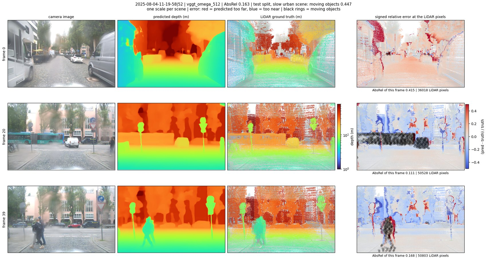
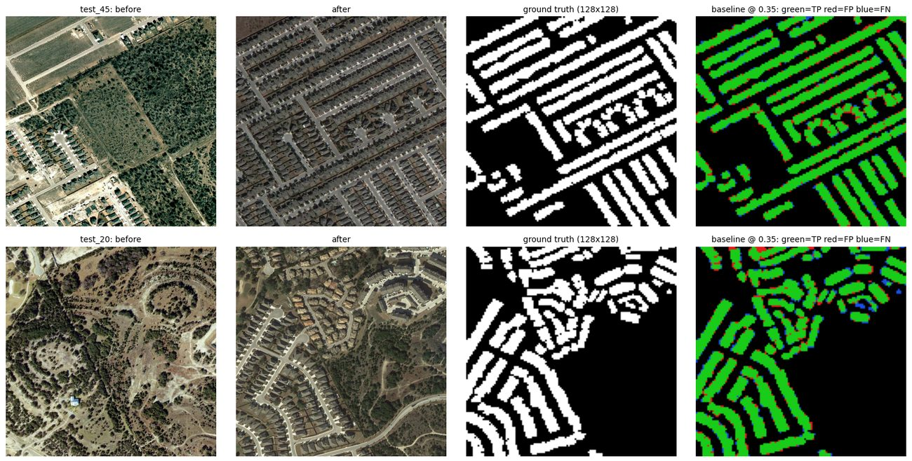
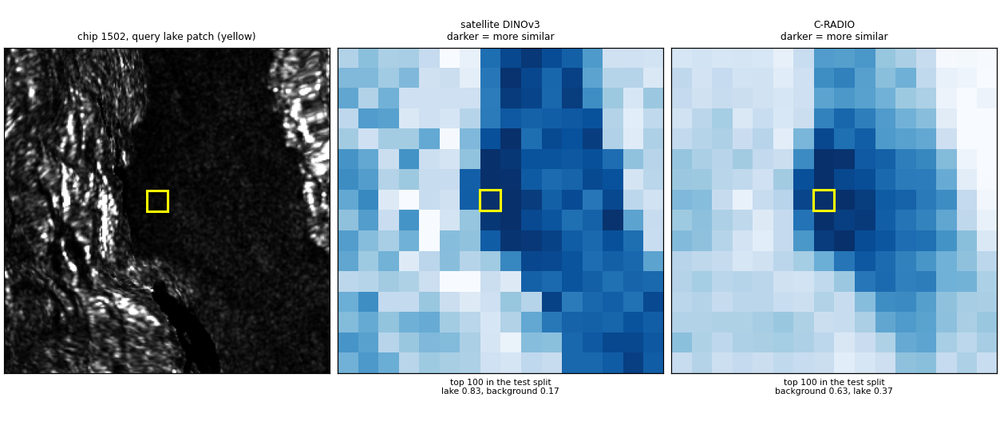
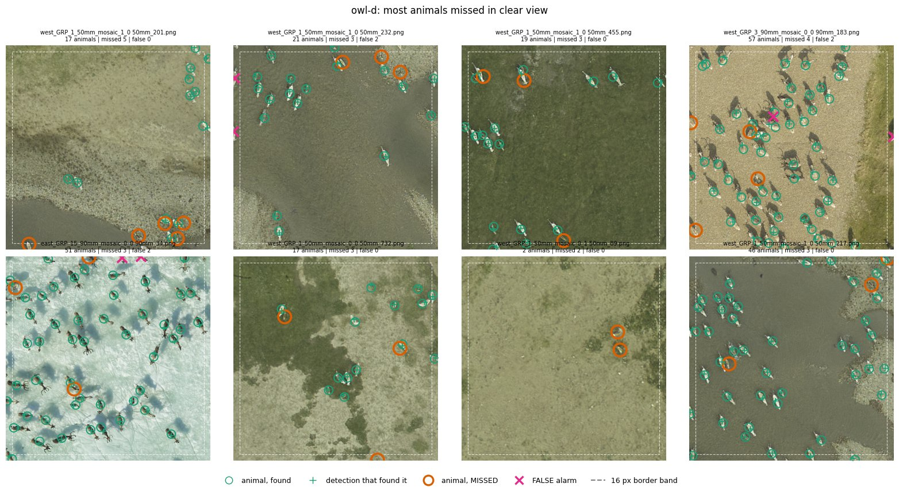
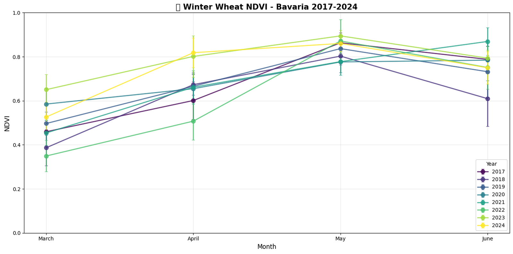

# Abhishek Singh

M.Sc. Data Science. Machine learning for Earth observation and remote sensing. Berlin, Germany.

  
  
  

From left, a SAR calving front from a frozen photo-pretrained encoder (CaFFe, Sentinel-1); VGGT-Ω depth error on a driving scene, black rings mark moving objects (FZI-AURA); new buildings found from frozen DINOv3 features (LEVIR-CD).

## Projects

<table>
<tr>
<td width="34%"></td>
<td>

**[sar-transfer-glaciers](https://github.com/saverin0/sar-transfer-glaciers)** — Do frozen encoders
pretrained on optical images transfer to SAR? Glacier calving-front delineation on the CaFFe
benchmark with frozen DINOv3 (satellite and photo), C-RADIOv4-H and two SAR-pretrained encoders,
only small probes and heads trained on top, a U-Net from scratch as reference. A 0.57 M-parameter
decoder on frozen C-RADIO features matches the 7.8 M-parameter U-Net on front error on the test
glaciers (979 ± 31 m vs 979 m). Photo-pretrained encoders beat the SAR-pretrained ones we tried,
and satellite pretraining gave no clear advantage over photo pretraining.

</td>
</tr>
<tr>
<td></td>
<td>

**[sar-transfer-domains](https://github.com/saverin0/sar-transfer-domains)** — Part two of the SAR
study. The same frozen pipeline, nothing tuned per dataset, on four Sentinel-1 datasets (glacial
lakes, snow, forest types, alpine glaciers). With a small decoder, the satellite-pretrained DINOv3
is ahead of C-RADIOv4-H on every dataset and test split (snow IoU 0.735 vs 0.602), the reverse of
the glacier study. In the one like-for-like published comparison, frozen features reach a snow F1
of 0.847 against 0.897 for a U-Net trained on the same radar channels. From one lake patch, 83 % of
the 100 most similar test patches are lake for the satellite DINOv3, against 37 % for C-RADIO.

</td>
</tr>
<tr>
<td></td>
<td>

**[vggt-omega-aura-benchmark](https://github.com/saverin0/vggt-omega-aura-benchmark)** — Failure
analysis of the released VGGT-Ω 3D reconstruction checkpoint on FZI-AURA, a driving dataset
published after the model and so outside its training data. Depth and pose error are broken down
by weather, lighting and object motion instead of averaged. Daytime depth on the held-out test
split reaches AbsRel 0.082; error concentrates on thin objects, people and moving vehicles.
Python reference implementation with a C++ core for the scoring.

</td>
</tr>
<tr>
<td></td>
<td>

**[Change-Detection-Using-Dinov3](https://github.com/saverin0/Change-Detection-Using-Dinov3)** —
Building change detection on frozen satellite-pretrained DINOv3 features, on SpaceNet-7 monthly
imagery and LEVIR-CD. Decoder designs compared on identical features, feature differencing at
0.56M parameters and cross-attention at 0.83M, finished within 0.002 F1 of each other at 0.910 on
LEVIR-CD, so the smaller head was the one to keep. Both beat the frozen embeddings read directly
by roughly ten times on SpaceNet-7. Trained on a free Colab T4.

</td>
</tr>
<tr>
<td></td>
<td>

**[owl-caribou-overhead](https://github.com/saverin0/owl-caribou-overhead)** — Cross-herd,
cross-year evaluation of four overhead animal detectors on 2,607 aerial survey patches of the
Central Arctic caribou herd (Alaska, 2022), with error bars from resampled mosaics, a failure analysis and a
threshold sweep. The two best models tie threshold-free (average precision 0.978 vs 0.977); the
gap at the fixed setting is an operating-point effect. Half of the remaining errors sit in a 16 px
band at the patch border, and most of those are real animals the patch's ground truth does not list.

</td>
</tr>
<tr>
<td></td>
<td>

**[bavaria-wheat-sentinel2-oco2](https://github.com/saverin0/bavaria-wheat-sentinel2-oco2)** —
Monthly NDVI and NIRv for winter wheat across the 96 NUTS-3 regions of Bavaria, 2017–2024, from
1.13 TB of Sentinel-2 L3A composites masked with yearly 10 m crop type maps, aggregated with exact
partial-pixel zonal statistics on the GPU. The Sentinel-2 half of a two-person MSc capstone. A side
analysis matches Sentinel-2 reflectance to OCO-2 solar-induced fluorescence footprints.

</td>
</tr>
</table>

## Master's thesis

Carried out at the **DLR Earth Observation Center**, Oberpfaffenhofen, on the detection of greenhouses
and plastic-covered parcels in southern Germany from 20 cm aerial orthophotos, with no
hand-drawn annotation anywhere in training. Labels were derived from EU parcel-level crop
declarations and refined against the imagery. The detector combines a frozen satellite-pretrained
DINOv3 backbone, decoded back to 20 cm by guided feature upsampling, with a trainable ResNet-34
branch and a small fusion head. Supervised by Dr Ursula Gessner (DLR) and Prof Dr Iftikhar Ahmed
(UE). A paper is in preparation.

## How I work

Most of my projects derive training labels from registers or benchmarks that were never made for
the purpose, then deal with the biases those labels carry. A result that has come back in every
project so far is that, past a small model budget, improving the data moves accuracy further than adding
model capacity does, and I measure both sides rather than assume it. Pipelines are numbered
stages with pinned environments so someone else can rerun them, and evaluation is on sites and
conditions held out from training, not on random splits.

## Experience

- **Student Assistant, Robotics and Perception**, TU Berlin, 2025–2026. Onboard image capture and
  control components in Python for REINCARNATE, a Horizon Europe consortium project.
- **Test Engineer**, Infosys, India, 2021–2024. Automated test pipelines in Java and JavaScript
  with Selenium and TestNG, and data validation in SQL.

## Education

- **M.Sc. Data Science**, University of Europe for Applied Sciences, Potsdam, 2024–2026.
- **B.Eng. Electronics and Communication Engineering**, Jaypee Institute of Information
  Technology, India, 2016–2020.

## Tools

Python, PyTorch, C++17 (CMake, pybind11), SQL. GDAL, rasterio, geopandas, xarray, QGIS, Google
Earth Engine, STAC. Linux, Git, Docker, pinned environments. GPU training on A100 and HPC on LRZ
terrabyte (SLURM).

## Contact

- LinkedIn — [abhishekzsingh](https://www.linkedin.com/in/abhishekzsingh)
- Website — [saverin0.github.io](https://saverin0.github.io)

Figure data from CaFFe (Gourmelon et al. 2022, CC BY 4.0), Glacial-Lake-Bench (Kaushik et al., CC BY 4.0), FZI-AURA, LEVIR-CD, the OWL caribou survey release (CC BY-NC-SA 4.0) and DLR Sentinel-2 composites.
